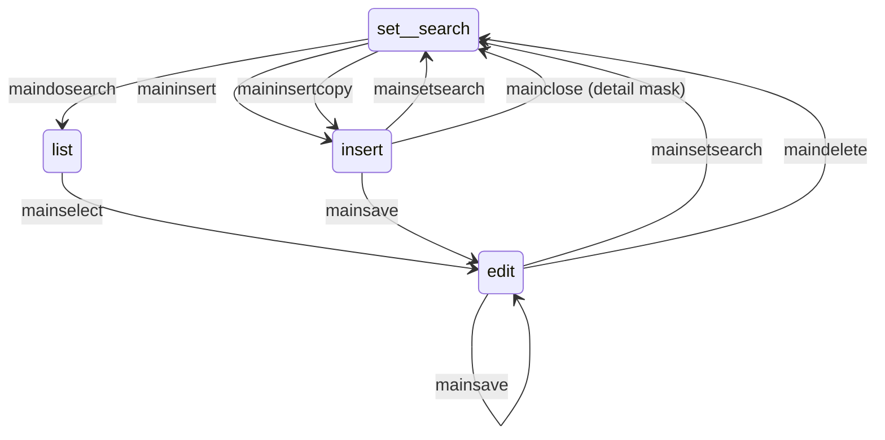

[](https://github.com/TempoSrl/myKode_Frontend/blob/master/MetaPage.it.md)

# MetaPage

Classes derived from MetaPage contain the JavaScript code that implements specific behaviors for a web page, if any. 
Conversely, the base class MetaPage implements all common behaviors for all pages.

It's important to understand these common behaviors to integrate or modify them according to the needs of each individual page when necessary.

A page (MetaPage) does nothing on its own until the user interacts with the controls it contains or with any menus or other tools that invoke its methods. 
Therefore, to understand how a page works, you need to understand the different controls it can contain.

A page is always associated with a DataSet, and each control contained in the page is associated with tags that determine which field of which 
 row (i.e., which table) the control refers to. The structure of a DataSet has already been described on the [initial page](readme.md). 
The association between MetaPage and DataSet occurs in the init method of MetaPage.

In general, there can be two types of controls on a page: controls that display a single value (such as text, select, etc.) and controls that display 
 multiple values (such as table, treeview, etc.).

Controls that display a single value refer to a row that must be uniquely determined based on the current row of the main table being displayed.

For controls that display a single value, the table and column to which they refer are specified in the tag, as explained in the [HTML page](MetaPageHtml.md), 
 which details how to create the HTML view associated with MetaPage.

The table should be such that, starting from the main row and following the relationships present in the DataSet, the row reached in the given table 
 is unique, and the field indicated in the tag of that row will be displayed.

Similarly, the same field of the same row will be used to modify existing values if the table is the main entity or one of its sub-entities in a 
 one-to-one relationship with the main row.

Controls that display multiple rows usually show a child table of the main table.

## Types of Pages

There are two main types of forms: **single** or **list**.

A **"single"** form displays one row of the main table at a time, and to select another, it must be cleared with a "set search" command and then 
 filled with another row, typically by selecting it from a list calculated based on filters or by creating a new row with the insert command. 
 We divide single forms into two categories:

- Main form: in this case, you find, among others, the buttons "set search," "perform search," "delete," "insert," "save."
- Detail form: these are forms that display details of a main form and only have the "Ok" and "Cancel" buttons.

A **"list"** form displays a grid, tree, or other multi-row controls where you can select a row and see the form update with the data for that row
 (and related sub-entities).

## Creating MetaPage

To create a page, you need to create a class derived from MetaPage, following the classic JavaScript programming conventions:

```js
(function(){
    function meta_<tableName>() {
        MetaPage.apply(this, arguments);
        this.name = <PageName>;
    }
    metaPage_<tableName>.prototype = _.extend(
        new MetaPage(<TableName>, <EditType>, <bool:iDetail>),
        {
            constructor: metaPage_<tableName>,
            superClass: MetaPage.prototype,
            <base_class_function_to_override>,
            <private_functions>
        }
    )
}())
```

## Main Methods of a Page

### Constructor

In the constructor, the following boolean properties can be optionally overridden:

- searchEnabled: indicates if searching is allowed. (default true)
- mainSelectionEnabled: indicates if "main select" is enabled. (default true)
- canInsert: indicates if insertion is allowed. (default true)
- canInsertCopy: indicates if copying and insertion are allowed. (default true)
- canSave: indicates if saving is allowed. (default true)
- canCancel: indicates if cancellation is allowed. (default true)
- startEmpty: indicates if the list should not be filled at the start of the application. (default false).


These properties can be changed at any time, another good time to set them is in the afterLink method.

The page type can be defined by setting the following properties:

- isList: indicates that it is a list-type form. (default false).
- isTree: indicates a main form with a tree manager. (default false).

## Configuration Parameters

Additionally, the following parameters can be configured:

- **startFilter**: It is a `jsDataQuery` expression representing a filter on the data that you want to apply at the page level.

- **additionalSearchCondition**: It is a `jsDataQuery` expression representing a filter to apply at the page level when conducting a search. For example, if you want the mask to already filter a specific field during a search, you should include the following line of code in the constructor of `MetaPage`:

```js
this.additionalSearchCondition = window.jsDataQuery.eq("<field_name>", "value");
```

Of course, you can insert any type of expression you want. (Refer to the documentation on [JsDataQuery](https://github.com/TempoSrl/myKode_Backend/blob/main/jsDataQuery.md))

- **defaultListType**: It is the default `listType` initialized by the framework to the string "default." You need to override it if you use a new `listType`. For this, insert an entry in the **web_listredir** table, where there is the mapping between the original `tablename` and `listtype` with the new ones **newtablename** and **newlisttype**. The page, during the search, will query the view indicated in the newtablename field. Of course, it will be necessary to create a server-side metadata of the type meta_<newtablename>.

- If the page is public, you need to insert the following function call in the constructor of the derived `MetaPage`:

```js
appMeta.connection.setAnonymous();
```

In this case, all calls to web services will be authenticated anonymously. The anonymous token is currently hardwired with code and shared with the backend. For security, all anonymous connections in the backend are filtered and potentially blocked if executed on unauthorized datasets. To see the backend configuration, refer to section 4.1.1.

The constructor of a class derived from `MetaPage` will be something like:

```js
function(){
    function metaPage_<tableName>() {
        MetaPage.apply(this, arguments);
        this.name = <PageName>;
    }
    metaPage_<tableName>.prototype = _.extend(
        new MetaPage(<TableName>, <EditType>, <bool:iDetail>),
        {
            constructor: metaPage_<tableName>,
            superClass: MetaPage.prototype,
            ...base class methods to override,
            ...private functions
        }
    )
}())
```

## Loading MetaPages

MetaPages are loaded within the container whose ID is stored in `appMeta.rootElement`.

```html
<head>
    <!-- Contains the framework's JavaScript scripts -->
</head>

<body>
    <div id="appRoot">
        <!-- div hosting the menu bar -->
        <div id="menu"></div>

        <!-- div hosting the toolbar -->
        <div class="container" id="toolbar" hidden></div>

        <!-- container where MetaPages will be hosted -->
        <div class="container" id="metaRoot"></div>
    </div>
</body>
```

In this example, it is assumed that `appMeta.rootElement` is "metaRoot." 
The `AppMeta` class expects that the buttons of the toolbar are present in the container with a name equal to `appMeta.currApp.rootToolbar`.

### `freshForm(refreshPeripherals, doPreFill)`

Dumps the content of the DataSet into the form controls, displaying the current data. 
If `refreshPeripherals` is true, it triggers a re-reading of satellite tables before display. 
If `doPreFill` is true, it causes a read of cached tables. Typically, it is true only the first time the form is displayed and concerns tables underlying dropdowns (SELECT tags).

It's important to note that before actual control filling, the `beforeFill` method of MetaPage is invoked, and similarly, the `afterFill` method is called after filling. 
These represent two hooks that can be overridden to enrich the page with specific behaviors.

### `getFormData(noCheck)`

Reads data from the form, updating the content of the DataSet accordingly. In custom event handling for a form, there is usually a sequence:

```javascript
   let result = await this.getFormData(false);  // reads data
   /// event handling, possibly modifies dataset
   await this.freshForm(false);       // displays updated data
```

This is useful if the event handling needs to modify data. If it has purely aesthetic effects, it's not necessary to include it in the `getFormData`/`freshForm` cycle. 
By default, `getFormData` also performs a client-side check, using metadata associated with tables, of modified rows, which can be entities or sub-entities at any level. 
If the `noCheck` parameter is true, the validity check is skipped, and only the data in the DataSet is read.

It is common practice to call `getFormData(true)` for intermediate states of the form and `getFormData(false)` when saving data to the database to perform client-side checks first.

The client-side checks, present in the `isValid()` methods of metadata, can be non-ignorable or ignorable. In the latter case, they might show confirmation windows to the user for any issues in the data. 
In such cases, the user can decide to accept the data as is or modify it before proceeding with the save.

The method returns a `Deferred<true>` if the data is correct or if it is decided not to validate it; otherwise, it returns a `Deferred<false>`. 
After reading the data, the `afterGetFormData` event is raised through the `eventManager`.

### `rowSelect(sender, table, row)`

Automatically invoked when a row of a certain table is selected to update the form accordingly. 
It is called, for example, when selecting a row from a list, a dropdown, or selecting a row in a grid. 
However, this method can also be manually invoked if custom controls are implemented that involve selecting rows from a table.

At this point, the `EventEnum.ROW_SELECT` event is also triggered with the same parameters as the method.

### `isEmpty()`

Returns true if the form contains no data, meaning it is in search filter setup mode.

### `editClick(metaPage, grid)`

Invoked when the edit button linked to a grid is pressed. 
The `editClick(grid)` event of the `eventManager` is also generated. "this" refers to the MetaPage. 
This command (and similar ones) can be used even if there is a custom control implementing the `getCurrentRow()` method instead of a grid.

### `insertClick(metaPage, grid)`

Invoked when the insert button linked to a grid is pressed. 
The `insertClick(grid)` event of the `eventManager` is also generated. "this" refers to the button that triggered the click.

### `deleteClick(metaPage, grid)`

Invoked when the delete button linked to a grid is pressed. 
The `deleteClick(grid)` event of the `eventManager` is also generated. "this" refers to the button that triggered the click.

### `unlinkClick(metaPage, grid)`

Invoked when the unlink button in a grid is pressed. 
Unlinking disconnects the row from the main table but does not delete it. The `unlinkClick(grid)` event of the `eventManager` is also generated. 
"this" refers to the button that triggered the click. 
The row is "disconnected" in the sense that the fields that link it from the main table are set to null.

### `addDependencies(elParent, elChild, event)`

Associates the modification of an `elParent` element with the execution of a recalculation on the `elChild` element when the "event" is triggered on the `elParent` element.

This is useful when there is a need to recalculate some controls in the form when other controls are modified. 
The modification can trigger a cascade that ends when there are no more changes or dependencies.

### `registerFormula(elChild, fn)`

Registers the formula necessary when `elChild` needs to be recalculated. 
This will be automatically invoked based on events on the controls that `elChild` depends on.

### `setDataTagAttr(el, value)`

Sets the data-tag attribute of the element to the specified value. This function serves as a shortcut for:

```javascript
        $(el).attr('data-tag', value);
```

Caution: Avoid using the jQuery function `.data("tag", value)`, as it does not affect the DOM.

### `saveFormData()`

Initiates the process of saving the form data, including the invocation of business rules. 
However, before calling this method, it is typically necessary to invoke `getFormData(false)` and ensure that client-side validation has succeeded.

This method is invoked, along with `getFormData()` and others, when the "save" button on the toolbar is pressed.

### `createAndGetListManagersearch(TableName, listingType, prefilter, isModal, rootElement, metaPage, filterLocked, toMerge, isCommandSearch, sort)`

This method is used to obtain the mask that manages listings. 
It can be redefined in MetaPages that intend to use a different type of list, for example, with a calendar object instead of a list of rows.


## Toolbar

myKode provides automatic management of a toolbar that handles the transition between the set search/insert/edit states of the displayed data. 
It is also possible not to use it, and in that case, the following commands will be invoked:

### `commandEnabled(tag)`

Determines whether the command indicated by the tag is enabled or not. Possible commands include:

- `create_ticket`: creates a ticket to be sent to support
- `mainclose`: closes the mask, potentially returning to the calling mask. Invokes `cmdClose`.
- `mainselect`: selects the current row (in a "list" mask)
- `maininsert`: inserts a new row. This is done by invoking the `cmdMainInsert` method of MetaPage.
- `maininsertcopy`: inserts a new row as a copy of the current one (with its related entities). Invokes `cmdMainInsertCopy`.
- `maindosearch`: performs a search based on the content of the mask controls, which must be in the "set search" state. Makes a call to `cmdMainDoSearch`.
- `mainsetsearch`: clears the mask and sets it to the "set search" state. Invoked by `cmdMainSetSearch`.
- `mainsave`: saves the data in the mask. This is done by invoking the `cmdMainSave` method.
- `maindelete`: deletes the current row with its subentities. Invoked by the `cmdMainDelete` method, which in turn invokes the `doDelete` method.

The mask, in general, can be in three states:

- Set search
- Edit
- Insert



### Set Search

The mask enters the set search state when it has just been opened or when the `mainsetsearch` command is invoked after 
saving data (`mainsave`) or after canceling changes being made.

### Edit

The mask is in edit mode if we select (`mainselect`) a row from the main table from a list and then start editing it. 
Or when we save (`mainsave`) a row that was in the insert state.

### Insert

The mask is in insert mode when we use the `maininsert` or `maininsertcopy` command. Canceling the edit will return 
to the Set Search state, saving the data will move to the Edit state.


## Detail Masks

If a grid (HTML table) is present in the mask that displays a sub-entity table of the main table, it is possible to open a new mask corresponding to the rows present or create new ones very easily: just create a mask associated with the detail table and set the grid tag accordingly.

For example, remembering that the grid tag has the format `tablename.listType.editType`, if the grid tag is

    ordine.main.single

it will be necessary to register, using the `addMetaPage(tableName, editType, metaPage)` method of MetaApp, an appropriate mask, for example:

    metaApp.addMetaPage("ordine", "single", detailPage)

where `detailPage` is the MetaPage associated with the respective page.

When opening, by pressing the "insert" or "edit" button of a grid, the detail mask, data transfer is performed 
from the mask where you are, which includes the row being modified/inserted and its sub-entity rows (of each order), from the DataSet 
of the source mask to that of the detail mask.

At the end of the modification/insertion in the detail mask, if you decide to keep the changes, the DataSet of the source mask will 
be updated by adding the data from the detail mask (only for its related entity and sub-entities). Their fate will then depend on what 
is decided in the main mask, whether to save or reject them.

If, instead, you decide to cancel the changes, the reverse transfer will not be performed, and in the case where a row was being inserted, 
it will be removed from the main DataSet.

These interactions between the main and detail masks are managed by the default behaviors of the buttons related to grids (HTML tables).

The methods related to grids are:

- `editClick(metaPage, controller)`: modifies the currently selected row in the grid/tree/other.
- `insertClick(metaPage, controller)`: inserts a new row into the table.
- `deleteClick(metaPage, controller)`: deletes the currently selected row.
- `unlinkClick(metaPage, controller)`: unlinks the currently selected row.

These methods are automatically called when pressing buttons for modification/insertion associated with a grid, tree, calendar, 
or other custom controls that enable such behaviors.

The standard behavior of these buttons is to invoke the `getCurrentRow` method of the controller to know which row to modify 
or delete and, in the case of insertion/modification, open the mask using the `edittype` present in the grid/tree/other tag.


## Standard Passive Controls

Controls of type INPUT, TEXTAREA, and DIV, SPAN associated with valueSigned do not generate any activity when the user modifies their content. There might be some events related to the formatting of INPUT/TEXT input and output, but these are not "page" activities.

## Custom Control

Other controls, including grids (HTML TABLE), combos (HTML SELECT), and all others, are managed as "custom controls," meaning they have classes that expose a predefined interface and are used uniformly by the page.

This makes it relatively simple and natural to "invent" new visual controls for various purposes. With this interface, it has been possible to uniformly manage lists, dropdowns, various types of grids, calendar controls, trees, buttons for file download or upload, etc. It is such a well-tested interface that it is also used for common controls such as the HTML SELECT tag.

Adding new controllers is safe, easily testable, and never compromises existing pages.

The interface includes the following methods, which may also be absent:

- `getCurrentRow`: to be defined in "grid" type controls where it is possible to select a row for editing. It should return the currently selected row where it makes sense.

- `fillControl(el)`: fills the control `el` with the data associated with the controller.

- `preFill(el, param)`: performs one-time initialization operations when the web mask first appears.

- `clearControl(el)`: empties the control.

- `getSearchCondition(el, col, tagSearch)`: obtains the search condition from that control, which, along with conditions from other controls on the mask, is used to compose the query-by-example when conducting searches.

- `addEvents(el, metaPage)`: called during the page initialization, should, if necessary, add any event handlers to the control.

- `getControl(el, objrow, column)`: reads the value of the control in `objrow`. If the controller has the `isCustomGetcontrol` property, the `getControl` method is invoked without parameters; otherwise, these are calculated based on the tag and the current row to which the control refers.

- `el`: associated HTML control.

- `init`: if present, this method is called during prefill, only once.

Of these methods, the essential ones are `fillControl`, `clearControl`, and `getControl`. To manage an HTML control as a custom control, it will be necessary to specify in its attributes `data-custom-control="custom control code"`, where you have previously associated this code with a custom controller by calling

```js
appMeta.CustomControl("custom control code", controllerConstructor);
```


## Main Events (Hooks)

These methods are invoked in the life cycle of a page and are customizable to personalize their behavior. For easier maintenance, it is advisable to use these methods whenever possible.

In fact, placing a behavior in one method rather than another makes it clear to the reader "when" that behavior should be activated.

When writing the body of these methods, consider the phase of the page. For example, in the `beforeFill` method, you cannot assume that the current data is already in the mask, unlike the `afterFill` method.

Similarly, unconditionally calling the `freshForm()` method in the `afterFill` method will cause an infinite loop since the `freshForm` method, in turn, calls `afterFill`.

It is crucial, therefore, when redefining the following methods, to consider the phase in which the mask is at that moment.

### \{Deferred\} afterLink

**Invoked once**

This `MetaPage` method is called when the page has been loaded into the DOM, only once for each instance of the `MetaPage`. In this method, one-time operations can be performed, such as adding events to controls, one-time enable/disable actions, adding runtime controls or properties to the mask, and similar operations.

Another operation that can be performed in this phase is to use the `setList(ctrl)` method to set the page as a list and indicate the page's list manager. The page's list manager is an HTML control, such as `$("#id_control_manager")`, which can be, for example, a grid or a tree.

## \{Deferred\} beforeRowSelect(table, row)

Called before selecting a row.

## \{Deferred\} afterRowSelect(table, row)

Invoked whenever a row `row` is selected from a table `table`, allowing the page to react accordingly. For example, recalculate or modify fields or show/hide controls based on the selected row.

## \{Deferred\} beforeFill()

Invoked before a mask is filled with DataSet data. It can be used to add or remove controls or change the tag of some control before that control is filled with data. Doing so afterward would not change its actual content.

Also, at this stage, the content of the DataSet has not yet been poured onto the page, so it is still possible to modify the DataSet and see the changes applied to the page controls.

Page filling is generally done multiple times, for example, when a detail page is opened and then closed. Each time this happens, the `beforeFill` and `afterFill` methods will be called.

## \{Deferred\} afterFill()

Invoked after a mask has been filled with all the data. It can be used to supplement automatically displayed data. In this method, it can be assumed that the mask's data is already aligned with that in the DataSet.

## \{Deferred\} beforeClear()

Invoked before emptying a mask following a "set search" command.

## \{Deferred\} afterClear()

Invoked after emptying a mask following a "set search" command. It can be used to empty controls without tags and filled in a modified `afterFill` method.

This method is also called every time, scrolling through a list, you move from one row to another. In this case, a `clear()` is performed first, and then the form is filled with the data of the newly selected row. Therefore, `afterClear`, `beforeFill`, `afterFill` will trigger sequentially.

## \{Deferred\} beforePost()

Invoked before the form data is posted, i.e., before sending it to the backend to write it to the database, after acquiring data from the controls.

## \{Deferred\} freshToolBar()

Invoked when updating the toolbar. It is possible to insert additional actions or replace/remove the use of the toolbar altogether.

## setPageTitle()

Invoked when displaying the page title. It can be used to customize it. It usually displays the name of the edited entity followed by the state of the mask.

## \{Deferred\} beforeActivation()

**Invoked once**

Called before filling the tables of a form, the first time it is shown. It can be used, for example, to specify additional tables for which to perform prefill (put them in the cache). Another useful point for this purpose is the `afterLink()` method. Note that tables associated with SELECT are automatically cached (read only once).

Example:

```js
appMeta.metaModel.cachedTable(table, true); // marks the table 'table' as cached

//// Set static filter
this.state.DS.tables.table1.staticFilter(window.jsDataQuery.eq("idtable1", id));

// Mark some tables as temporary to ensure they are not read/written from the database by the library.
// In this case, it is up to the developer to fill or empty these tables as needed.
appMeta.metaModel.temporaryTable(table, true);
```

## \{Deferred\} afterActivation()

**Invoked once**

Called before displaying the data of a form for the first time, after performing the prefill of the DataSet tables that are eventually cached.