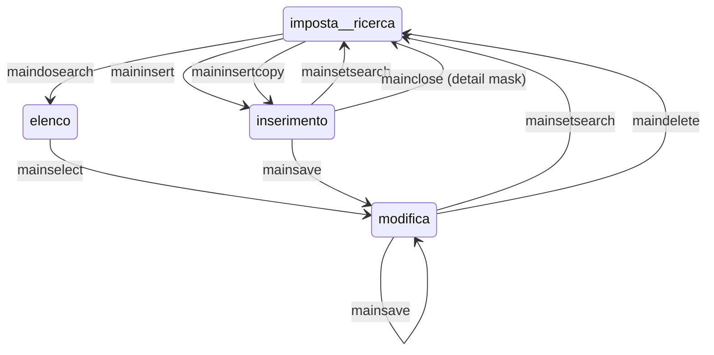

# MetaPage

Le classi derivanti da MetaPage contengono il codice javascript che implementa i comportamenti specifici di una pagina web, ove ve ne siano.
Viceversa, la classe base MetaPage, implementa tutti i comportamenti comuni a tutte le pagine. 

E' importante capire quali siano questi comportamenti comuni per poterli integrare o modificare in base alle esigenze di ogni singola pagina, ove sia necessario.

Una pagina (MetaPage) di per se non fa nulla sin quando l'utente non interagisce con i controlli in essa contenuti o con eventuali menu o altri strumenti che ne invochino i metodi. Pertanto per comprendere come funziona una pagina occorre comprendere i diversi controlli che essa può contenere.

Una pagina è sempre associato ad un DataSet, ed ogni controllo contenuto nella pagina è associato a dei tag che determinano a quale campo di quale riga (ossia di quale tabella) il controllo si riferisca. Si è già descritto nella [pagina iniziale](readme.md) la struttura di un DataSet. L'associazione tra MetaPage e DataSet avviene nel metodo init della MetaPage.

In generale in una pagina possono esserci due tipi di controlli: controlli che visualizzano un valore (come text,select, etc.) e controlli che visualizzano tanti valori (come table, treeview etc). 

I controlli che visualizzano un valore si riferiscono ad una riga che deve essere univocamente determinata in base alla riga della tabella principale correntemente visualizzata.

Per i controlli che visualizzano un valore la tabella e la colonna a cui si riferiscono è specificata nel tag, come spiegato nella pagina [HTML](MetaPageHtml.md), in cui è spiegato nei dettagli come realizzare la vista html associata alla MetaPage.

La tabella dovrebbe essere tale per cui, a partire dalla riga principale e seguendo le relazioni presenti nel DataSet, è unica la riga a cui si perviene nella tabella data, e di quella riga sarà visualizzato il campo indicato nel tag. 

Analogamente lo stesso campo della stessa riga sarà utilizzato per modificare i valori esistenti, qualora la tabella sia l'entità principale o una sua subentità in relazione uno a uno con la riga principale.


I controlli che visualizzano più righe solitamente visualizeranno una tabella figlia della tabella principale.

## Tipi di pagina

Esistono due principali tipi di form (maschera): **singolo** o **lista**. 

Un form **"singolo"** visualizza una riga della tabella principale alla volta, e per selezionarne un'altra va svuotato con un comando di "imposta ricerca" e poi riempito con un'altra riga, tipicamente selezionandola da un elenco calcolato in base a dei filtri, oppure creando una nuova riga con il comando di inserimento.
Dividiamo i form singoli in due categorie: 

- form principale: in questo caso troviamo, tra gli altri, i bottoni "imposta ricerca", "effettua ricerca", "elimina", "inserisci", "salva
- form dettaglio: sono form che visualizzano dettagli di una maschera principale, e hanno solo i bottoni "Ok" e "Annulla"

Un form **"lista"** visualizza un grid, un tree o altri controlli multi riga in cui si può selezionare una riga e vedere la maschera aggiornarsi con i dati di quella riga (e subentità relative).

## Creazioni di MetaPage

Per creare una pagina, sarà necessario creare una classe derivata da MetaPage, con i canoni classici della programmazione javascript:

```js

        function(){
            function meta_<tableName>() {
                MetaPage.apply(this, arguments);
                this.name = <NomePagina>;
            }
           metaPage_<tableName>.prototype = _.extend(
               new MetaPage(<TableName>, <EditType>, <bool:iDetail>),
               {
                   constructor: metaPage_<tableName>,

                   superClass: MetaPage.prototype,

	             <funzione_classeBase_da_sovrascrivere>, 		
    	             <funzioni_private>
               }
        )
        }())
```

## Metodi principali di una pagina


### Costruttore

Nel costruttore possono essere sovrascritte in maniera del tutto opzionale le seguenti proprietà booleane:

- searchEnabled: indica se è permessa la ricerca. (default true)
- mainSelectionEnabled:indica se è abilitata la funzione di “main select” (default true)
- canInsert: indica se è permesso l’inserimento (default true)
- canInsertCopy: indica se è permessa la copia e inserimento (default true)
- canSave: indica se è permesso il salvataggio (default true)
- canCancel: indica se è permessa la cancellazione (default true)
- startEmpty: indica se la lista non deve essere riempita allo start dell’applicazione. (default false).

Queste proprietà possono essere cambiate in ogni momento, un altro momento buono per impostarle è il metodo afterLink.

E' possibile definire il tipo di pagina valorizzando le proprietà:

- isList: indica che si tratta di form di tipo lista. (default false).
- isTree: indica un form principale con un tree manager (default false).


Inoltre si possono configurare i seguenti parametri:

- startFilter: è un’espressione jsDataQuery che rappresenta un filtro sui dati che si vuole applicare a livello di pagina. 

- additionalSearchCondition: è un espressione jsDataQuery che rappresenta un filtro da applicare al livello di pagina quando si fa una ricerca. Se ad esempio vogliamo che in fase di ricerca la maschera debba già filtrare un determinato campo allora si dovrà inserire sul costruttore della MetaPage la seguente riga di codice:

```js
    this.additionalSearchCondition = window.jsDataQuery.eq(“<nome_campo>”, “valore”).  

```


Naturalmente è possibile inserire qualsiasi tipo di espressione che si vuole. (Fare riferimento alla documentazione su [JsDataQuery](https://github.com/TempoSrl/myKode_Backend/blob/main/jsDataQuery.md))


- defaultListType: è il listType di default che viene inizializzato dal framewrok alla stringa “default”. Bisogna sovrascriverlo se si utilizza un nuovo listType.
  Bisogna inserire per questo una entry sulla tabella **web_listredir**, in cui c’è il mapping tra il tablename e listtype originali con quelli nuovi **newtablename** e **newlisttype**. La pagina in fase di ricerca effettuerà la query quindi sulla vista indicata nel campo newtablename. Naturalmente sarà necessario realizzare un metadato lato server del tipo meta_<newtablename>.

- Se la pagina è pubblica, bisogna inserire nel costruttore della MetaPage derivata la chiamata alla funzione 

```js
        appMeta.connection.setAnonymous();
```
 In questo caso tutte le chiamate ai servizi web saranno autenticate in maniera anonima. Il token anonimo è per ora cablato a codice e condiviso con il backend. Nel backend per sicurezza tutte le connessioni anonime vengono filtrate ed eventualmente bloccate se eseguite su dataset non permessi. Per vedere la configurazione backend vedere il paragrafo 4.1.1
 

Il costruttore di una classe derivata da MetaPage sarà qualcosa tipo:


```js

    function(){
        function metaPage_<tableName>() {
            MetaPage.apply(this, arguments);
            this.name = <NomePagina>;
        }
    metaPage_<tableName>.prototype = _.extend(
        new MetaPage(<TableName>, <EditType>, <bool:iDetail>),
        {
            constructor: metaPage_<tableName>,

            superClass: MetaPage.prototype,
            
	        ...metodi classeBase da sovrascrivere, 		
    	    ..funzioni_private
        }
    )
    }())


Le MetaPage sono caricate all'interno del contenitore il cui id è memorizzato in appMeta.rootElement

```html

<head>
	<!-- Contiene gli script js del framework -->
</head>

<body>
    <div id="appRoot">
       <!-- div che ospita la barra del menù-->
       <div id=”menu”></div>

       <!-- div che ospita la toolbar -->
       <div class="container" id="toolbar" hidden></div>

     <!-- contenitore dove andranno ospitate le MetaPage -->
       <div class="container" id="metaRoot"> </div>
    </div>
</body>

```

in questo esempio si è supposto che appMeta.rootElement sia "metaRoot"
La classe AppMeta si aspetta che i bottoni della toolbar siano presenti nel contenitore di nome pari a appMeta.currApp.rootToolbar


### freshForm(refreshPeripherals, doPreFill)

Riversa il contenuto del DataSet nei controlli del form, che quindi visualizzerà i dati correnti.
refreshPeripherals se true causa la rilettura delle tabelle satellite prima della visualizzazione
doPreFill se true causa la rilettura delle tabelle in cache, di solito è true solamente la prima volta che viene visualizzata la maschera e riguarda le tabelle sottostanti le tendine (tag SELECT)

E' da notare che prima dell'effettivo riempimento dei controlli, è richiamato il metodo beforFill della MetaPage, e dopo il riempimento è richiamato, analogamente, il metodo afterFill. Questi rappresentano due hook, che possono essere ridefiniti per arricchire la pagina di comportamenti particolari.

### getFormData(noCheck) 

Legge i dati presenti nella maschera aggiornando di conseguenza il contenuto del DataSet.
Di norma negli eventi custom gestiti da una maschera, ci sarà una sequenza:

           let result = await this.getFormData(false);  //legge i dati
           /// gestione dell'evento, eventualmente modifica i dati del dataset
           await this.freshForm(false)       //mostra i dati aggiornati

questo serve se la gestione dell'evento deve modificare i dati, se invece ha effetti puramente estetici, non è necessario inserirla nel ciclo getFormData/freshForm.

Di norma getFormData effettua anche una verifica lato client, tramite i metadati associati alle tabelle, delle righe modificate, che possono essere entità o subentità di ogni livello. Se il parametro noCheck è passato come true, il controllo di validità non è effettuato e sono solo letti i dati nel DataSet. 

Di solito è prassi chiamare getFormData(true) per gli stati intermedi della maschera, e getFormData(false) se si stanno per salvare i dati sul database, per fare agire prima i controlli lato client.

I controlli lato client, presenti nei metodi isValid() dei metadati, potranno essere non ignorabili o ignorabili, nel qual caso potrebbero mostrare delle finestre di conferma all'utente per eventuali problemi presenti nei dati. L'utente potrà quindi decidere, in tali casi, di accettare comunque i dati come sono o modificarli prima di procedere con il salvataggio.

Il metodo restituisce un Deferred\<true> i dati sono corretti o se si è deciso di non validarli, altrimenti un Deferred\<false>

Dopo la lettura dei dati, è effettuato il raise dell'evento afterGetFormData tramite l'eventManager.


### rowSelect(sender, table, row)

E' un metodo invocato automaticamente quando è selezionata una riga di una certa tabella, per aggiornare la maschera di conseguenza. E' chiamato ad esempio se si seleziona una riga da un elenco, da una tendina, o si seleziona una riga in un grid. Tuttavia è possibile invocare questo metodo manualmente se si implementano dei controlli custom che prevedono la selezione di righe di una tabella.

Nell'occasione è anche scatenato l'evento EventEnum.ROW_SELECT con gli stessi parametri del metodo.

### isEmpty()

Restituisce true se la maschera non contiene dati, ossia è in modalità di impostazione del filtro di ricerca


### editClick (metaPage, grid)

E' invocato quando è premuto il bottone di edit collegato ad un grid. E' anche generato l'evento editClick(grid) dell'eventManager. "this" è la MetaPage. E' possibile usare questo commando (e gli altri simili) anche se invece di un grid c'è un altro controllo custom che implementi il metodo getCurrentRow()


### insertClick (metaPage, grid)

E' invocato quando è premuto il bottone di insert collegato ad un grid.  E' anche generato l'evento insertClick(grid) dell'eventManager.  "this" è il botton che ha scatenato il click.


### deleteClick(metaPage, grid)

E' invocato quando è premuto il bottone di delete collegato ad un grid.  E' anche generato l'evento deleteClick(grid) dell'eventManager.  "this" è il botton che ha scatenato il click.


### unlinkClick(metaPage, grid)

E' invocato quando è premuto il bottone di unlink in un grid. L'unlink scollega la riga dalla tabella principale, ma non la cancella. E' anche generato l'evento unlinkClick(grid) dell'eventManager.  "this" è il botton che ha scatenato il click. 
La riga è "scollegata" nel senso che i campi che la relazionano dalla tabella principale sono posti a null.


### addDependencies(elParent, elChild, event) 

Associa alla modifica di un elemento elParent l'esecuzione di un ricalcolo sull'elemento elChild quando sull'elemento elParent si scatena l'evento "event"

Questo è utile quando si ha la necessità di ricalcolare alcuni controlli della maschera in corrispondenza della modifica di altri controlli. La modifica può innescare una cascata che termina quando non ci sono più modifiche o non ci sono più dipendenze.


### registerFormula(elChild, fn)

Registra la formula necessaria quando c'è da ricalcolare l'elemento elChild. Questa sarà invocata in automatico in base agli eventi sui controlli da cui elChild dipende.


### setDataTagAttr(el, value)

Imposta il tag data-tag con il valore value. E' una scorciatoia per

         $(el).attr('data-tag', value);

Attenzione a non usare la funzione .data("tag",value) di jQuery, che non agisce sul DOM.


### saveFormData()

Avvia il processo di salvataggio degli stessi, inclusa l'invocazione delle regole di business.
Tuttavia prima di invocare questo metodo necessario, è di solito necessario invocare getFormData(false) e verificare che la validazione lato client sia andata a buon fine.

Questo metodo è chiamato invocato, insieme a getFormData() e altri, quando si preme il bottone "salva" sulla toolbar.


### createAndGetListManagersearch(TableName, listingType, prefilter, isModal, rootElement, metaPage, filterLocked, toMerge, isCommandSearch, sort)

E' un metodo usato per ottenere la maschera che gestisce gli elenchi. Può essere ridefinito nelle metaPage che intendono usare un altro tipo di elenco, ad esempio con un oggetto calendario invece di una lista di righe.


## Toolbar

myKode prevede una gestione automatica di una toolbar che gestisce la transizione tra gli stati imposta ricerca / inserimento / modifica dei dati visualizzati. E' possibile anche non usarla ed in quel caso si invocheranno i comandi 

### commandEnabled(tag)

Stabilisce se il comando indicato dal tag è abilitato o meno. I possibili comandi sono:

- crea_ticket: crea un ticket da inviare all'assistenza
- mainclose: chiude la maschera, tornando eventualmente alla maschera chiamante. Invoca cmdClose.
- mainselect: seleziona la riga corrente (in una maschera "lista")
- maininsert: inserisce una nuova riga. Questo è effettuato invocando il metodo cmdMainInsert della MetaPage
- maininsertcopy: inserisce una nuova riga come copia di quella corrente (con le relative subentità). Invoca cmdMainInsertCopy.
- maindosearch: effettua la ricerca sulla base del contenuto dei controlli della maschera, che deve trovarsi nello stato di "imposta ricerca" . Effettua una chiamata a cmdMainDoSearch.
- mainsetsearch: svuota la maschera e la pone nello stato di "imposta ricerca". Effettuato invocando cmdMainSetSearch.
- mainsave: salva i dati presenti nella maschera. Questo è effettuato invocando il metodo cmdMainSave
- maindelete: cancella la riga corrente con le sue subentità. Effettuato invocando il metodo cmdMainDelete, che a sua volta invoca il metodo doDelete


La maschera in generale può trovarsi in 3 stati: 

- imposta ricerca
- modifica
- inserimento



### Imposta ricerca

La maschera si va a trovare nello stato di imposta ricerca quando l'abbiamo appena aperta o quando invochiamo il comando mainsetsearch dopo aver salvato dei dati (mainsave) o dopo aver annullato le modifiche che stavamo facendo

### Modifica

La maschera si trova nello stato di modifica se selezioniamo (mainselect) una riga della tabella principale da un elenco e poi iniziamo a modificarla. Oppure quando salviamo (comando mainsave) una riga che era nello stato di inserimento.

### Inserimento

La maschera si trova nello stato di inserimento quando usiamo il comando maininsert o maininsertcopy. Annullando la modifica si ritornerà allo stato Imposta ricerca, salvando i dati si passerà allo stato Modifica


## Maschere di dettaglio

Se nella maschera è presente un grid (html table) che visualizza una tabella subentità della tabella principale, è possibile aprire una nuova maschera in corrispondenza delle righe presenti, o crearne delle nuove in modo molto semplice: basterà creare una maschera associata alla tabella di dettaglio ed impostare il tag del grid in modo conseguente. 

Ad esempio, ricordando che il tag del grid ha il formato tablename.listType.editType, se il tag del grid è

    ordine.main.single

sarà necessario registrare, con il metodo  addMetaPage(tableName, editType, metaPage) della MetaApp, una maschera opportuna, ad esempio:

    metaApp.addMetaPage("ordine","single", paginaDiDettaglio)

ove paginaDiDettaglio è la MetaPage associata alla pagina in questione.

Quando si apre, premendo il bottone "inserisci" o "modifica" di un grid,la maschera di dettaglio, è effettuato un travaso dei dati della maschera in cui ci si trova, che include la riga oggetto di modifica/inserimento e le sue righe subentità (di ogni ordine), dal DataSet della maschera di provenienza a quello della maschera di dettaglio.

Al termine della modifica/inserimento nella maschera di dettaglio, se si decide di mantenere le modifiche effettuate, sarà aggiornato il DataSet della maschera di origine unendovi i dati della maschera di dettaglio (solo della sua relativa entità e subentità). Il loro destino dipenderà poi da cosa si deciderà di fare nella maschera principale, se salvarle o rigettarle.

Se invece si decide di annullare la modifiche, non sarà effettuato il travaso inverso, e nel caso in cui si stava inserendo una riga, questa sarà rimossa dal DataSet principale.

Queste attività di interazione tra maschera principale e dettaglio sono gestite dai comportamenti di default dei bottoni relativi ai grid (html table).

I metodi relativi ai grid sono:

        editClick(metaPage, controller)    //modifica la riga correntemente selezionata nel grid/tree/altro
        insertClick(metaPage, controller)  //inserisce una nuova riga nella tabella
        deleteClick(metaPage, controller)  //cancella la riga correntemente selezionata
        unlinkClick(metaPage, controller)  //scollega la riga correntemente selezionata

questi metodi sono automaticamente chiamati quando ad un bottone di modifica/inserimento associati ad un grid, tree, calendar o altri controlli custom che abilitino tali comportamenti.

Il comportamento standard di tali bottoni è invocare il metodo getCurrentRow del controller per sapere quale riga modificare o cancellare e nel caso di inserimento/modifica, aprire la maschera usando l'edittype presente nel tag del grid/tree/altro.


## controlli passivi standard

I controlli di tipo INPUT, TEXTAREA, e DIV, SPAN ove associati a valueSigned, non generano alcuna attività quando l'utente ne modifica il contenuto. Potrebbe esserci qualche evento collegato alla formattazione in ingresso/uscita dagli INPUT/TEXT ma non si tratta di attività di "pagina".


## Custom control

Altri controlli, tra cui i grid (html TABLE), i combo (html SELECT) e tutti gli altri sono gestiti come "custom control", ossia con delle classi che espongono un'interfaccia predefinita e che vengono usati dalla pagina in modo omogeneo.

Questo rende relativamente semplice e naturale "inventare" nuovi controlli visuali con scopi disparati. Con questa interfaccia è stato possibile gestire in modo omogeneo liste, tendine, grid di vario genere, controlli calendario, tree, bottoni per il download o per l'upload di file etc. 
E' un'interfaccia talmente collaudata da essere usata anche per i controlli comuni quali il tag html SELECT

L'aggiunta di nuovi controller è sicura, facilmente testabile e non compromette mai le pagine preesistenti.

L'interfaccia prevede i seguenti metodi, che possono anche mancare:

- getCurrentRow: è da definire nei controlli tipo "grid" in cui è possibile selezionare una riga per editarla. Deve restituire la riga correntemente selezionata ove la cosa abbia senso

- fillControl(el): deve riempire il controllo el con i dati associati al controller

- preFill(el, param): effettua delle operazioni di inizializzazione che sono una-tantum, quando la maschera web appare la prima volta

- clearControl(el): svuota il controllo

- getSearchCondition(el, col, tagSearch): ottiene la condizione di ricerca da quel controllo, che insieme alle altre provenienti dagli altri controlli della maschera, serve a comporre il query-by-example quando si effettuano delle ricerche

- addEvents(el, metaPage): è richiamato all'atto dell'inizializzazione della pagina, dovrebbe, ove necessario, aggiungere eventuali gestori di evento al controllo

- getControl(el, objrow, column): legge il valore del controllo in objrow. Se il controller ha la proprietà isCustomGetcontrol, il metodo getControl è invocato senza parametri, altrimenti questi sono calcolati in base al tag ed alla riga corrente a cui il controllo si riferisce

- el: controllo html associato

- init: ove presente questo metodo, è richiamato in fase di prefill, una volta sola


Di questi metodi, quelli indispensabili sono fillControl, clearControl e getControl.
Per gestire un controllo html come Custom control sarà necessario specificare, nei suoi attributi, data-custom-control="codice controllo custom" ove si sia preventivamente provveduto, in fase di inizializzazione del programma, ad associare a tale codice un custom controller invocando

           appMeta.CustomControl("codice controllo", costruttoreGestoreControllo); 


## Eventi principali (Hook)

Questi metodi sono richiamati nel ciclo di vita di una maschera, e sono ridefinibili per personalizzarne il comportamento. Per una più facile manutenzione, è bene cercare di usare questi metodi ogni volta che sia possibile. 

Infatti inserire un comportamento in un metodo anziché in un altro rende ben chiaro a chi legge "quando" dovrebbe essere attivato quel comportamento.

Nello scrivere il corpo di tali metodi tener conto della fase della maschera. Ad esempio, nel metodo beforeFill, non è possibile assumere che nella maschera vi siano già i dati correnti, a differenza del metodo afterFill. 

Similmente, chiamando il metodo freshForm() in modo incondizionato nel metodo afterFill si causerà un loop infinito visto che il metodo freshForm a sua volta richiama afterFill.

E' pertanto cruciale nella ridefinizione dei metodi che seguono tener conto della fase in cui si trova la maschera in quel momento.


###  \{Deferred\} afterLink

**Richiamato una volta sola**

Questo metodo di MetaPage è invocato quando la pagina è stata caricata nel dom, una volta sola per ogni istanza della MetaPage. In questo metodo si possono inserire operazioni da fare una-tantum, quali aggiunta di eventi ai controlli, abilitazioni/disabilitazioni una-tantum, aggiunta a runtime di controlli o prorietà alla maschera e simili

Un'altra operazione che si può fare in questa fase è utilizzare il metodo setList(ctrl) per impostare la pagina come lista, ed indicare il manage lista della pagina. Il manager lista della pagina è un controllo html, quindi del tipo $(“#id_controllo_manager”) che può essere ad esempio un grid oppure un tree


## \{Deferred\} beforeRowSelect(table, row) 

Richiamata prima della selezione di una riga


## \{Deferred\} afterRowSelect(table, row) 

E' invocato ogni qualvolta è selezionata una riga row da una tabella table, e consente alla pagina di reagire di conseguenza. Per esempio ricalcolare o modificare dei campi o fare apparire o scomparire dei controlli in base alla riga row.


## \{Deferred\} beforeFill()

E' invocato prima che una maschera sia riempita con i dati del DataSet. Può essere usato per aggiungere alcuni controlli o rimuoverli o cambiare il tag di qualche controllo prima che questo controllo sia riempito con i dati. Farlo dopo non ne cambierebbe infatti il contenuto effettivo.

Inoltre in questa fase il contenuto del DataSet non è ancora stato riversato sulla pagina, quindi si fa ancora in tempo a modificare il DataSet per poi vedere le modifiche applicate ai controlli della pagina.

Il fill di una pagina è effettuato in generale più volte, ad esempio quando viene aperta e poi chiusa una pagina di dettaglio. Ogni volta che ciò accade, saranno richiamati i metodi beforeFill e afterFill

## \{Deferred\} afterFill()

E' invocato dopo che una maschera è stata riempita con tutti i dati. Può essere usato per integrare i dati visualizzati in automatico. Si può assumere in questo metodo che i dati della maschera siano già allineati a quelli presenti nel DataSet.


## \{Deferred\} beforeClear()

E' invocato prima dello svuotamento di una maschera a seguito da un comando di "imposta ricerca"


## \{Deferred\} afterClear()

E' invocato dopo lo svuotamento di una maschera a seguito da un comando di "imposta ricerca". Può essere usato per svuotare controlli privi di tag e riempiti in un metodo afterFill modificato

Questo metodo è anche chiamato ogni volta che, scorrendo un elenco, si passa da una riga ad un'altra. In questo caso prima è effettuato un clear() e poi il form è riempito con i dati della nuova riga selezionata. 

Quindi scatteranno, in sequenza, afterClear, beforeFill, afterFill


## \{Deferred\} beforePost()

E' invocato prima che sia effettuato il Post dei dati del form, ossia prima di inviarli al backend per scriverli su database, dopo aver acquisito dati dai controlli. 


## \{Deferred\} freshToolBar()


E' invocato quando c'è da aggiornare la toolbar. E' possibile inserire azioni aggiuntive o sostituire o rimuovere del tutto l'uso della toolbar.


## setPageTitle()

E' invocato quando c'è da visualizzare il titolo della pagina. Può essere usato per personalizzarla. Di solito visualizza il nome dell'entità editata seguito dallo stato della maschera.

 
## \{Deferred\} beforeActivation()

**Richiamato una volta sola**

E' chiamato prima di effettuare il prefill delle tabelle di un form, la prima volta che viene mostrato. Può essere usato ad esempio per specificare tabelle aggiuntive di cui effettuare il prefill (metterle in cache). Un altro punto utile a tale scopo è il metodo afterLink(). Si ricorda che le tabelle associate alle SELECT sono automaticamente messe in cache (lette una volta sola)

Es.

```js
    appMeta.metaModel.cachedTable(table, true) //marca la tabella table come cached

    ////imposta filtro statico
    this.state.DS.tables.table1.staticFilter(window.jsDataQuery.eq("idtable1", id)); 
    
    //Marcare alcune tabelle come temporanee per far si che non siano lette/scritte dal db dalla libreria. 
    //In questo caso sarà cura dello sviluppatore riempire o svuotare tali tabelle all’occorrenza
    appMeta.metaModel.temporaryTable(table, true)


```


## \{Deferred\} afterActivation()

**Richiamato una volta sola**

E' chiamato prima di visualizzare i dati di un form la prima volta, dopo aver effettuato il prefill delle tabelle del DataSet che eventualmente sono cached.


